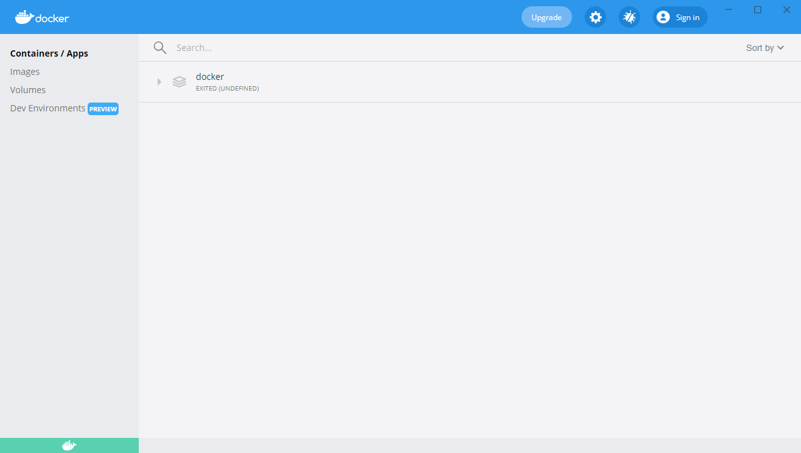
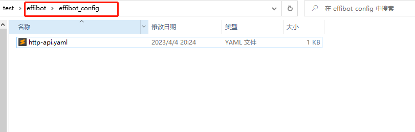
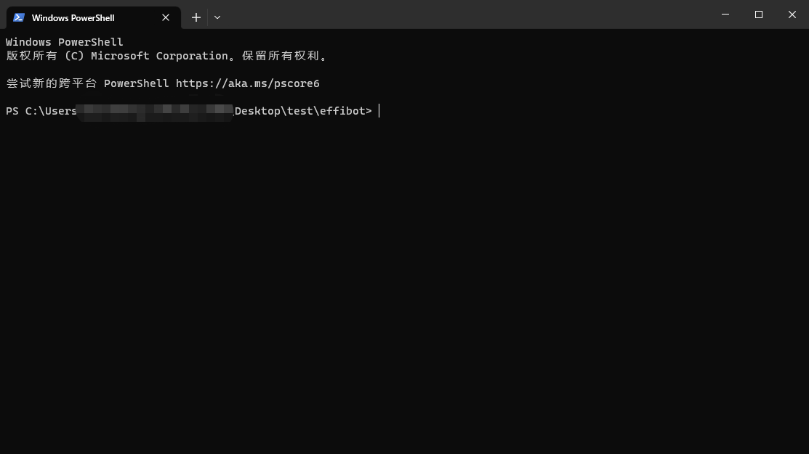
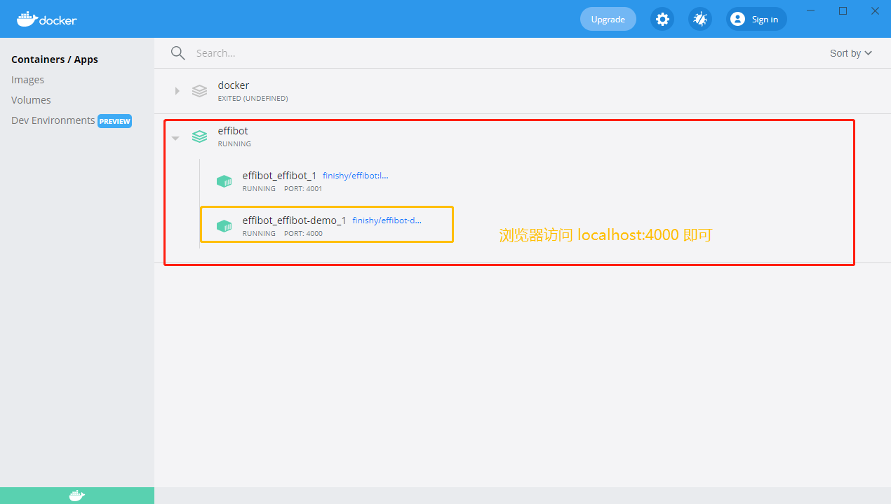
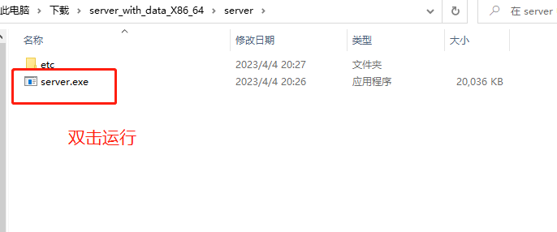
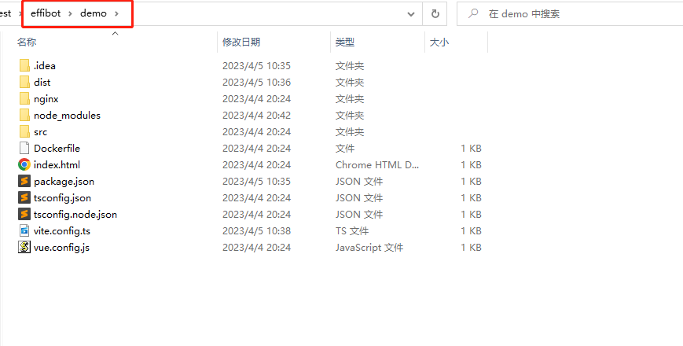

# effibot

[English](./README.md) | [中文](./README_CN.md)

Effibot 是一个 ChatGPT 服务器应用，基于树的数据结构存储处理数据，给用户提供思维导图般使用 ChatGPT 的问答体验。
树的结构能够极大程度优化上下文的传输量（token），在公司内部使用，可以提供更好的体验。


> 图为 Demo 客户端，UI 仅供参考。  

由于工作场景下深问同一个问题的情况较少，大部分场景下 token 能被控制在 2000 以内，
因此 GPT 3.5 的 token 上限（4096）完全够用（不考虑精确度无需 GPT4）。


> 前后两张截图时间不超过 5 分钟，由于多人使用的原因，
需要查看详细日志才能分辨上述五个问题的 token 消耗，但是可以看出整体 token 的消耗可控。

## Demo

[43.206.107.75:4000](http://43.206.107.75:4000)

Demo 环境未设置 OpenAI Token。

## 📢更新计划

- [ ] 用户登录
- [ ] 数据持久化存储
- [x] 快速部署脚本、镜像打包上传
- [ ] 加入写长篇小说的场景

**随缘更新**，用的人多就更新，用的人少就看心情更新。

欢迎基于这个项目开发 Web UI ！ Demo 里的 UI 是我自己写的，纯新手 UI。欢迎 PR ！

## 思路

[试用图论解决 GPT 保持会话信息问题](https://articles.zsxq.com/id_1u9cc8gccg78.html)  

将用户输入组织为一棵多叉树，只将当前分支的内容作为上下文信息传递给 GPT。
我们每次传输的内容数量，等于当前节点的深度。通过多叉树，来优化上下文的选择及传递。

一颗具有n个节点的正二叉树，其深度为 logn。这里的深度，就是我们要传递给 GPT API 的上下文信息。
如果我们不处理上下文，那可以看成一颗一维的树，即退变为一个线段，自然是最复杂的情况。
而如果我们将会话组织为树结构，即可得到一个思维导图。


## 部署环境须知
建议服务器地址选择 OpenAI 支持的国家或地区。机房和云主机均可，下述云经过测试：
1. Azure
2. AWS

如果非要在不支持的国家或地区测试，本项目完全支持代理，但是代理本身可能会 **影响体验和存在风险** 。
配置方式详见配置文件 Spec.GPT.TransportUrl。

不推荐使用代理的方式。风险自负。

## 克隆并进入项目目录

```bash
git clone https://github.com/finishy1995/effibot.git
cd effibot
```

## 配置文件设置

默认配置为 `Mock` 模式，即不会真正调用 GPT API，而是返回用户的输入作为回复。  

默认 REST API 端口为 `4001`，配置均可在 `http/etc/http-api.yaml` 中修改。

```bash
vi http/etc/http-api.yaml
```

```yaml
Name: http-api
Host: 0.0.0.0
Port: 4001 # Port of http server, default 4001
Timeout: 30000 # Timeout of http request, default 30000(ms)
Log:
  Level: debug
  Mode: file # Log mode, default console 日志模式，可选 console（命令行输出） 或 file
  Path: ../logs # Log file path, default ../logs
Spec:
  GPT:
#    Token: "sk-" # Token of OpenAI, will start mock mode if not set. OpenAI 密钥，如果不设置则启用 mock 模式
#    TransportUrl: "http://localhost:4002" # Transport url of OpenAI, default "http://localhost:4002 代理地址，如果不设置则不启用代理
    Timeout: 20s # Timeout of OpenAI request, default 20s
    MaxToken: 1000 # Max token of OpenAI response, default 1000
```

修改文件后，如果需要`一键部署`或使用`容器部署`，请执行如下命令
```bash
mkdir -p ./effibot_config
cp http/etc/http-api.yaml ./effibot_config
```

## 一键部署

确保 docker、docker-compose 已正确安装并启用。

```bash
docker-compose up -d
```

Demo 客户端将会运行在 `4000` 端口，REST API 将会运行在 `4000` 和 `4001` 端口。

如果你没有 docker-compose，可以使用如下命令：

```bash
docker network create effibot
docker run -p 4001:4001 -v ./effibot_config:/app/etc --network effibot --name effibot -d finishy/effibot:latest
docker run -p 4000:4000 --network effibot --name effibot-demo -d finishy/effibot-demo:latest
```

## 自定义开发/部署

### 服务器

确保 golang 1.18+ 已安装。

```bash
cd http
go run http.go # go build http.go && ./http
```

退出目录
```bash
cd ..
```

### 容器打包

```bash
docker build -t effibot:latest -f http/Dockerfile .
```

### 容器网络桥接（为了和 Demo 客户端连接）

```bash
docker network create effibot
```

### 容器部署

```bash
# Modify the configuration file as needed, such as adding the OpenAI token and change the log mode to console
docker run -p 4001:4001 -v ./effibot_config:/app/etc --network effibot --name effibot -d effibot:latest
```

### Demo 客户端容器打包

```bash
docker build -t effibot-demo:latest -f demo/Dockerfile .
```

### Demo 客户端容器部署

```bash
docker run -p 4000:4000 --network effibot --name effibot-demo -d effibot-demo:latest
```

### Demo 客户端开发

Demo 客户端由 Vue.js + Vite + TypeScript 开发，需要 Node.js 14+ 环境。

```bash
cd demo
yarn && yarn dev
```

Demo 客户端将自动打开在 [http://localhost:5173](http://localhost:5173).

## Windows 测试

推荐在 Windows 中使用自定义开发的方式进行开发/测试，由于部分朋友不会安装开发环境， 所以我们提供如下的测试方式。

如果你想使用下面的方法，可能意味着你对计算机等相关知识了解不够深入，建议 `不要写入 OpenAI token` `不要写入 OpenAI token`
`不要写入 OpenAI token`，不写入也能启动开发者模式进行测试。对可能存在的账号封禁风险，我们不负任何责任（如果对此有异议，千万不要执行下列步骤）。

### 一、Docker Desktop for Windows

能用 Docker 尽量用 Docker，方便快捷，并且能确保环境一致性。  

可以自行前往 Docker 官网，或 Google/Bing/Baidu 搜索 `Docker Desktop for Windows` 进行安装。

[Docker 官网](https://docs.docker.com/desktop/)

> 1. 如果你的 Windows 版本过低，可能会导致 Docker Desktop for Windows 无法安装。
> 2. 如果你已经安装了其他虚拟化软件，可能会导致 Docker Desktop for Windows 无法安装。 包括但不限于绝大部分手机模拟器、VMware、VirtualBox、Hyper-V 等。
> 3. 如果你的电脑设置为禁用虚拟化，可能会导致 Docker Desktop for Windows 无法安装。请详细查看相关教程获取帮助

成功安装后，打开 Docker Desktop



看到这个页面，说明 Docker Desktop for Windows 已经安装成功。下面我们准备一下配置文件：



> 注：老版本可能不直接存在这个文件，需要手动创建文件夹，并创建或复制这个文件。  
> 配置文件的内容，请参考上述配置介绍进行自定义更改。

在 ***项目根目录*** ，右键打开 Windows Terminal（或是默认的cmd，再或者是 powershell），截图使用 Windows Terminal，可在微软商店免费下载。



键入命令

```bash
docker-compose up -d
```

通过 Docker Desktop 确认容器是否启动成功。



浏览器访问 http://localhost:4000 即可看到 Demo 客户端。

### 二、非 Docker 启动

如果你的电脑不支持 Docker Desktop for Windows，或者你不想使用 Docker Desktop for Windows，你可以使用如下的方法进行测试。  

a. 安装 nodejs 环境

从 nodejs 官网下载安装包

[node 官网](https://nodejs.org/zh-cn/)

按照官网给的安装包安装

b. 下载编译好的服务器二进制文件及配置

[下载地址](https://github.com/finishy1995/effibot/releases/download/0.0.1/server_with_data_X86_64.zip)

c. 解压缩 zip 文件，并双击打开服务器执行程序



d. 进入项目下（注意不是 zip 解压后的目录，而是github上的项目），进入 demo 目录



e. 右击打开命令行工具，键入命令

```bash
npm install
npm run dev
```

浏览器访问 http://localhost:5173 即可看到 Demo 客户端。